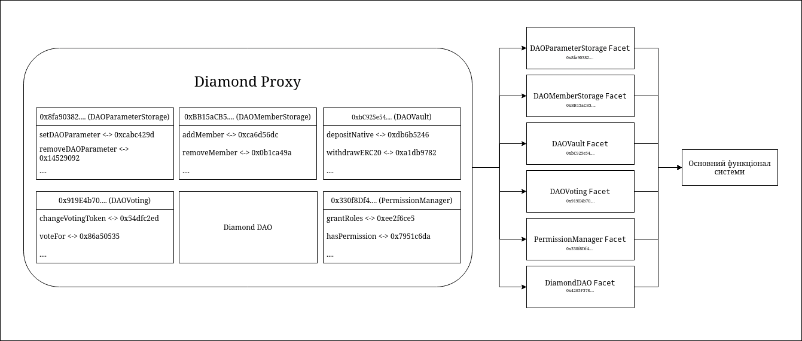
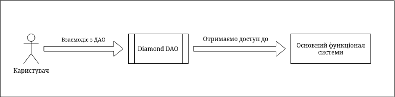
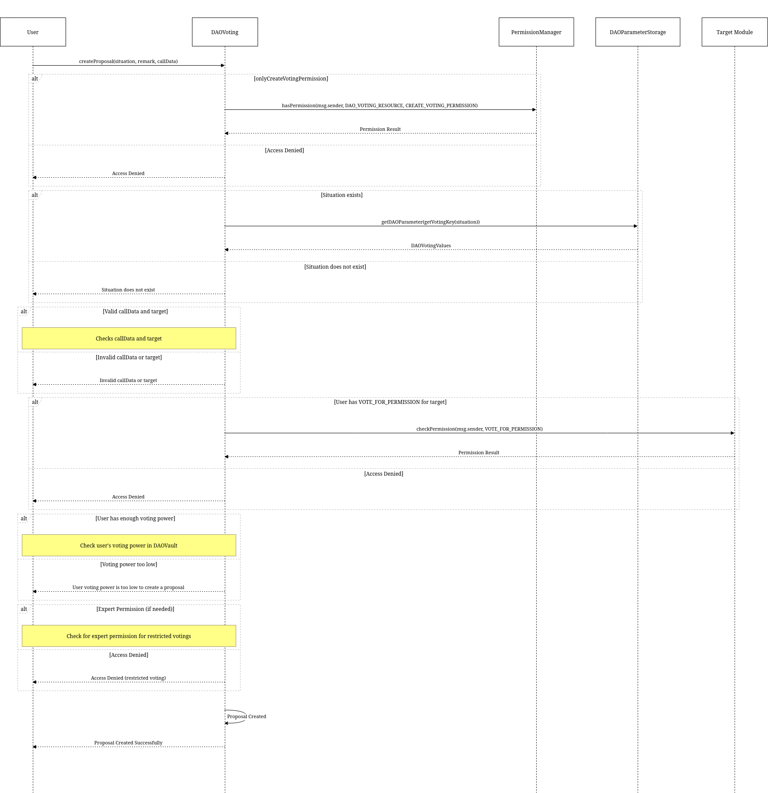

# Diamond DAO

[](https://codecov.io/gh/dl-solidity-library/dev-modules)
[](https://opensource.org/licenses/MIT)

## Загальний огляд

Децентралізована автономна організація, яку я розробив, має унікальний набір функцій, включаючи інтеграцію експертів, єдину точку входу, масштабованість і сумісність з The Graph API. Такий дизайн дозволяє ДАО розпізнавати типи голосувань, які потребують залучення експертів. Ці експерти можуть брати участь у процесі голосування за необхідності, тим самим покращуючи механізм прийняття рішень.

Архітектура цієї системи складається з декількох модулів, кожен з яких виконує свою функцію:
* Модуль зберігання параметрів (DAOParameterStorage): Цей модуль відповідає за зберігання параметрів системи.
* Модуль відстеження експертів (DAOMemberStorage): Цей модуль керує експертами в системі.
* Модуль зберігання цифрових активів (DAOVault): Цей модуль відповідає за зберігання цифрових активів учасників системи.
* Модуль для голосування (DAOVoting): Цей модуль потрібний для проведення голосувань в ДАО.
* Модуль управління ролями (PermissionManager): Цей модуль контролює управління ролями в системі.

Основною структурою системи є проксі (DiamondDAO), який діє як єдина точка входу в систему. Така структура забезпечує спрощену та ефективну взаємодію з платформою.



Система ДАО розроблена таким чином, щоб бути надійною та гнучкою. Залучення експертів додає ще один рівень прийняття обґрунтованих рішень. Модульна архітектура забезпечує ефективне управління параметрами, експертними, цифровими активами та ролями. Проксі забезпечує **єдину точку входу**, що підвищує зручність використання системи. 



## Процесс створення пропозиції



## Огляд DAO API

За допомогою API ми можемо встановити тривалість участі експерта в ДАО та його участь у голосуваннях, таким чином оцінюючи його активність. 

Ці дані про активність можуть бути використані для винагороди експертів або розширення їхніх прав, наприклад, надання їм повноважень керувати новим модулем, коли ДАО інтегрується з новим протоколом.

Крім того, API дозволяє відстежувати зміни параметрів ДАО та їх динаміку, що полегшує побудову статистики. Ці статистичні дані про параметри дозволять нам впевнено прогнозувати майбутнє і побудувати стандартну модель, в якій учасники ДАО почуватимуться комфортно. Наприклад, ми можемо визначити оптимальний період голосування на основі активності користувачів.

API також дозволяє відстежувати, хто з користувачів найбільш активний в ДАО, наприклад, за кількістю створених ним пропозицій, а також оцінювати якість цих пропозицій, тобто, чи були ці пропозиції прийняті чи ні. Більше того, ми можемо отримати загальну інформацію про користувача в одному запиті, що позбавляє від необхідності робити кілька запитів до різних кінцевих точок в ДАО на блокчейні.

## Огляд Permission API

API, який я розробив, відіграє ключову роль у відстеженні ролей та дозволів у системі децентралізованої автономної організації (ДАО). Цей інтерфейс особливо важливий для доступу до даних, які складно або майже неможливо отримати безпосередньо з блокчейну, до прикладу, таких як ролі в ДАО.

Ролі в ДАО - це, по суті, абстракція. Вони можуть називатися по-різному, але мати однакові права доступу. Аналіз і зберігання цієї інформації на рівні блокчейну, зокрема на рівні смарт-контрактів, є дуже ресурсоємним. Саме тут API доводить свою цінність.

Слухаючи такі події, як додавання ролі або дозвіл на роль, ми можемо агрегувати всю інформацію і зберігати список користувачів, які мають однакову роль на підграфі. Ми також можемо створити запит, який в результаті поверне нам список користувачів з однаковими або схожими ролями.

«Проекти зі складними смарт-контрактами, такі як Uniswap, та NFT-ініціативи, такі як Bored Ape Yacht Club, зберігають дані в блокчейні Ethereum, що робить дуже складним зчитування чогось, окрім базових даних, безпосередньо з блокчейну…. вам довелося б обробляти кожну подію передачі даних, зчитувати метадані з IPFS, використовуючи ідентифікатор токена та хеш IPFS, а потім агрегувати їх. Навіть на такі відносно прості запитання децентралізованому додатку (DApp), що працює в браузері, знадобилися б години або навіть дні, щоб отримати відповідь.»[8].

Без API досягнення цього вимагало б індексації всього блокчейну, а точніше, індексації блокчейну з моменту створення нашого ДАО. Це могло б стати непосильним завданням для звичайного комп'ютера. Крім того, API дозволяє нам уникнути ситуації, коли користувачеві або існуючим ролям призначаються схожі дозволи.


## Майбутнє та переваги цього API

Однією з ключових переваг підграфа, є здатність перевірити походження даних. Користувачі можуть переконатися, що дані отримані з певного підграфа і що маніфест або зіставлення, які в ньому використовуються, відповідають тим, що були зазначені розробником. Процес перевірки включає читання маніфесту підграфа з Міжпланетної файлової системи (IPFS) і перевірку початкового розгортання на The Graph. Така прозорість дозволяє користувачам самостійно перевіряти функціональність API.

На мій погляд, це значна перевага протоколу The Graph, який я використовував при створенні цього ДАО. Він підвищує гнучкість, безпеку і масштабованість ДАО, виділяючи його серед конкурентів.
Особливу увагу варто приділити сутностям та їх архітектурі. Підграф перестає синхронізуватися у випадку помилки, що робить збої вкрай небажаними. Щоб спростити відновлення, я використав паттерн, за яким, якщо сутність не існує в базі даних і ми намагаємося отримати її записи, вона буде автоматично створена. Ця функція особливо корисна тільки під час розробки.

Розробка такого програмного інтерфейсу не є звичайною справою. Дуже мало проектів застосовують цей підхід при розробці своїх ДАО через складність, специфічність технології та її новизну, враховуючи, що самому протоколу тільки п'яти років.

На мою думку, за цим підходом майбутнє розвитку ДАО. Він дозволяє знизити витрати на транзакції, делегуючи аналіз даних The Graph. А також даний протокол відповідаю принципам технології блокчейн.

«Однією з конкретних причин, близьких мені особисто, є те, що я називаю "підприємницькими суспільними благами": суспільні блага, які в даний час лише кілька людей вважають важливими, але в майбутньому будуть цінуватися набагато більшою кількістю людей... Тим не менш, нам не потрібно вирішувати кожну проблему сьогодні...»[8]

Таким чином, інтеграція протоколу The Graph в розробку ДАО є перспективним напрямком для підвищення їх масштабованості, гнучкості та безпеки. Вона забезпечує більш ефективний спосіб управління та взаємодії з даними організації, тим самим покращуючи загальний користувацький досвід.

## ПЕРЕЛІК ВИКОРИСТАНИХ ДЖЕРЕЛ
    
[1]: https://ethereum.github.io/yellowpaper/paper.pdf
[2]: https://bitcoin.org/bitcoin.pdf
[3]: https://eips.ethereum.org/EIPS/eip-2535
[4]: https://eips.ethereum.org/EIPS/eip-20
[5]: https://eips.ethereum.org/EIPS/eip-712
[6]: https://medium.com/q-blockchain/q-for-daos-e41b757b2af4
[7]: https://medium.com/q-blockchain/beyond-code-is-law-decentralin-short-governance-in-web3-today-is-a-complete-mess-so-what-do-8134ef10e655
[8]: https://thegraph.com/docs/en/
[10]: https://inevitableeth.com/en/home/ethereum/world-computer#the-ethereum-ecosystem-de-fi
[11]: https://noxx.substack.com/p/evm-deep-dives-the-path-to-shadowy-16e
[12]: https://vitalik.ca/general/2019/12/07/quadratic.html
[13]: https://www.gemini.com/cryptopedia/the-dao-hack-makerdao
[14]: https://ethereum.org/en/web3/
[15]: https://cointelegraph.com/news/tornado-cash-attacker-to-potentially-giveback-governance-control-proposal-reveals
[16]: https://github.com/dl-solidity-library/dev-modules/blob/master/contracts/access-control/RBAC.sol

1. Ethereum: A Secure Decentralised Generalised Transaction Ledger Berlin Version Beacfbd – 2022-10-24 [Електронний ресурс] – Dr. Gavin Wood Founder, Ethereum & Parity – Режим доступу до ресурсу [https://ethereum.github.io/yellowpaper/paper.pdf][1].

2. Bitcoin: A Peer-to-Peer Electronic Cash System [Електронний ресурс] – Satoshi Nakamoto – Режим доступу до ресурсу: [https://bitcoin.org/bitcoin.pdf][2].

3. ERC-2535: Diamonds, Multi-Facet Proxy, Ethereum Improvement Proposals, no. 2535, February 2020 [Електронний ресурс] –  Nick Mudge –  Режим доступу до ресурсу: [https://eips.ethereum.org/EIPS/eip-2535][3].

4. ERC-20: Token Standard, Ethereum Improvement Proposals, no. 20, November 2015 [Електронний ресурс] –  Fabian Vogelsteller, Vitalik Buterin – Режим доступу до ресурсу:  [https://eips.ethereum.org/EIPS/eip-20][4].

5. EIP-712: Typed structured data hashing and signing, Ethereum Improvement Proposals, no. 712, September 2017 [Електронний ресурс] – Remco Bloemen, Leonid Logvinov, Jacob Evans – Режим доступу до ресурсу: [https://eips.ethereum.org/EIPS/eip-712][5].

6. Q for DAOs, August 2022 [Електронний ресурс] – Martin Schmidt – Режим доступу до ресурсу: [https://medium.com/q-blockchain/q-for-daos-e41b757b2af4][6].

7. Beyond ‘Code is Law’ — Decentralized Governance in the Web3 World, December 2022 [Електронний ресурс] – Nicolas Biagosch – Режим доступу до ресурсу: [https://medium.com/q-blockchain/beyond-code-is-law-decentralin-short-governance-in-web3-today-is-a-complete-mess-so-what-do-8134ef10e655][7].

8. The Graph Documentation [Електронний ресурс] – Режим доступу до ресурсу: [https://thegraph.com/docs/en/][8].

9. Mastering Ethereum / [Andreas M. Antonopoulos, Gavin Wood]. – 2019, с. 127-128

10. Inevitable Ethereum, The Ethereum Ecosystem: De-Fi [Електронний ресурс] – Haym Salomon – Режим доступу до ресурсу:   [https://inevitableeth.com/en/home/ethereum/world-computer#the-ethereum-ecosystem-de-fi][10].

11. EVM Deep Dives: The Path to Shadowy Super Coder - Part 6, June 2022 [Електронний ресурс] – NOXX – Режим доступу до ресурсу: [https://noxx.substack.com/p/evm-deep-dives-the-path-to-shadowy-16e][11].

12. Quadratic Payments: A Primer, December 2019 [Електронний ресурс] – Vitalik Buterin – Режим доступу до ресурсу: [https://vitalik.ca/general/2019/12/07/quadratic.html][12]. 

13. What Was The DAO?, March 2019  [Електронний ресурс] – Cryptopedia Staff – Режим доступу до ресурсу: [https://www.gemini.com/cryptopedia/the-dao-hack-makerdao][13].

14. Introduction to Web3 [Електронний ресурс] – Режим доступу до ресурсу: [https://ethereum.org/en/web3/][14]. 

15. Tornado Cash attacker to potentially give back governance control, proposal reveals, May 20223 [Електронний ресурс] – Arijit Sarkar – Режим доступу до ресурсу: [https://cointelegraph.com/news/tornado-cash-attacker-to-potentially-giveback-governance-control-proposal-reveals][15].

16. Role-Based Access Control, RBAC [Електронний ресурс] – Artem Chystiakov – [https://github.com/dl-solidity-library/dev-modules/blob/master/contracts/access-control/RBAC.sol][16].

## Адреси контрактів

| index |        Contract        |                  Address                   |
|-------|:----------------------:|:------------------------------------------:|
| 0     |          SBT           | 0x377DF3D07e4eed44959840fF43ee857F146591C5 |
| 1     |         ERC20          | 0x9FC007e85e0dbC2B0Ae5Df5c8c370F4A614dA2b7 |
| 2     |         ERC721         | 0xaCFd432348e0fee95F0Ac8E9D71eee7c644c46a5 |


| index |      Contract       |                   Address                  |
|-------|:-------------------:|:------------------------------------------:|
| 0     |     DiamondDAO      | 0x4265F57803Fe21c34B86fe5E73A6AfFBc977bc24 |
| 1     |  PermissionManager  | 0x330f8Df43A63A0e77C3Dd4b4cbcb75081996E46D |
| 2     |      DAOVault       | 0xbC925e544Ab9245566B42fBD5Cf001BF59648B74 |
| 3     |      DAOVoting      | 0x919E4b70DCfEA57e042CC2B4d0f30C3E6437C8Cf |
| 4     | DAOParameterStorage | 0x8fa90382A8016EF782C2a52638ed21cAcb9066f5 |
| 5     |  DAOMemberStorage   | 0xBB15aCB501Bc072EB27600e0051Daaf46A3B3315 |


Only for authorized users!
=================================================================================

Build completed: QmdHT5NE5fFaceAzydrW7MZdfTJFznrFkDNwXy4u9sn7oS

Deployed to http://13.41.72.7:8000/subgraphs/name/dao-api/graphql

Subgraph endpoints:
Queries (HTTP):     http://13.41.72.7:8000/subgraphs/name/dao-api

Request example:
```graphql
{
  users {
    id
    tokens
    balances
    proposals {
      id
    }
  }
  experts {
    id
    startBlocks
    startTimestamps
    endBlocks
    endTimestamps
  }
  _meta {
    hasIndexingErrors
    block {
      number
    }
  }
}
```

=================================================================================

Build completed: QmXtHY6CH6Gu3DE7Gs6L66SqJM8DmZqax4z9K2WmEucm79

Deployed to http://13.41.72.7:8000/subgraphs/name/permission-api/graphql

Subgraph endpoints:
Queries (HTTP):     http://13.41.72.7:8000/subgraphs/name/permission-api

Request example:
```graphql
{
  roles {
    id
    resources {
      id
      allows
      disallows
    }
  }
  users {
    id
    rolesCount
    roles {
      id
    }
  }
  globals {
    totalUsersCount
  }
  _meta {
    hasIndexingErrors
    block {
      number
    }
  }
}
```
